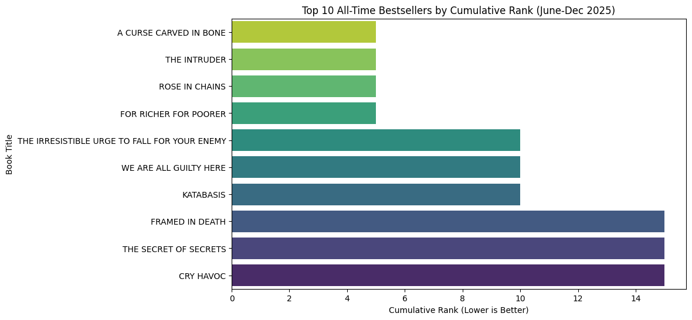
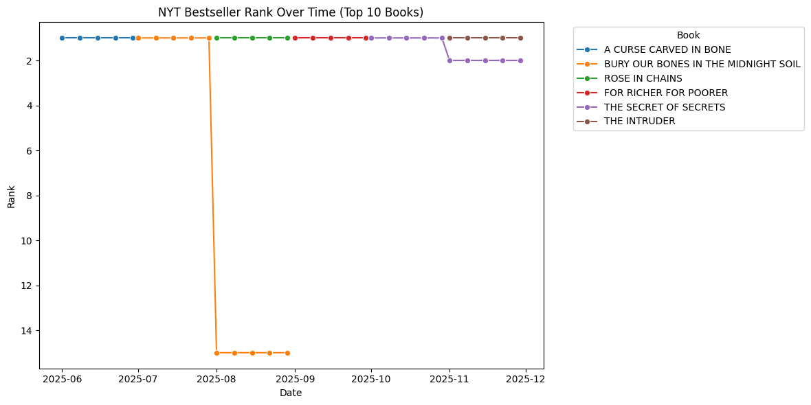
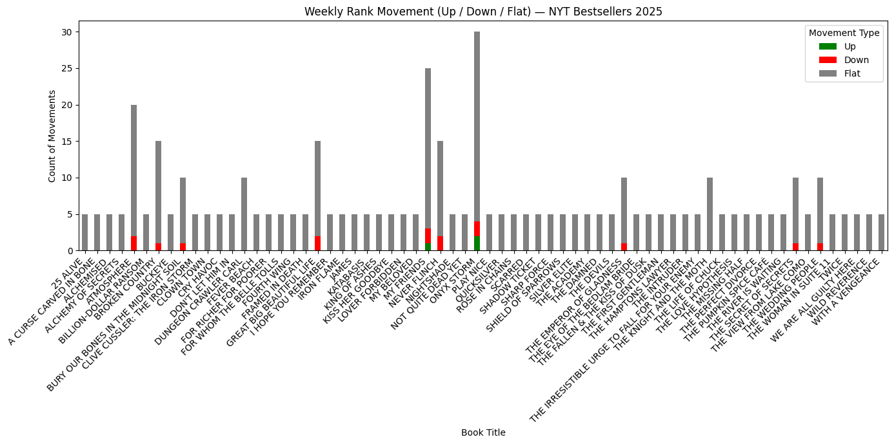
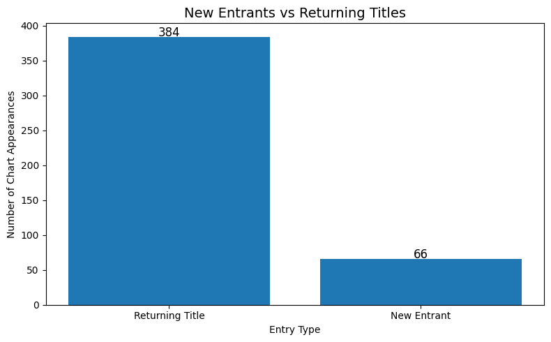
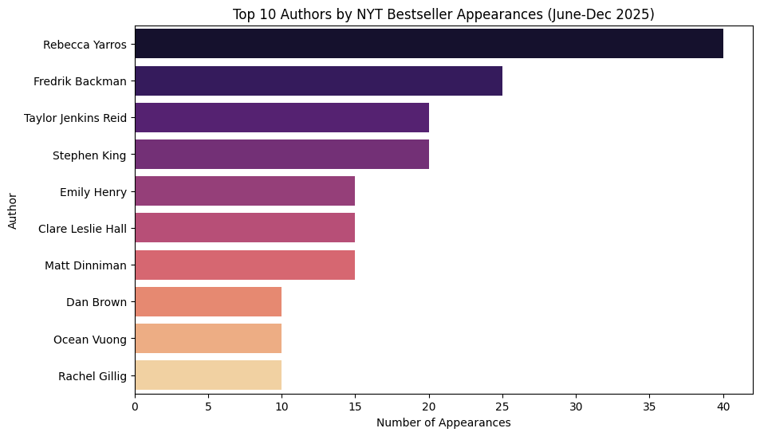
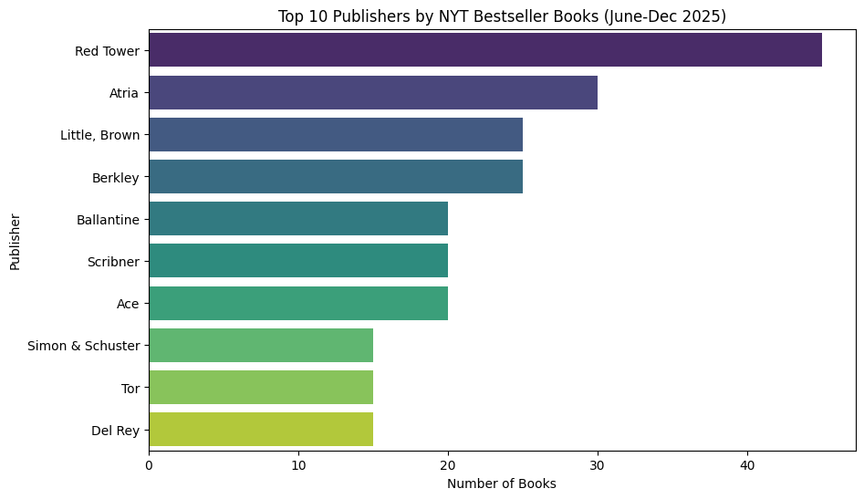
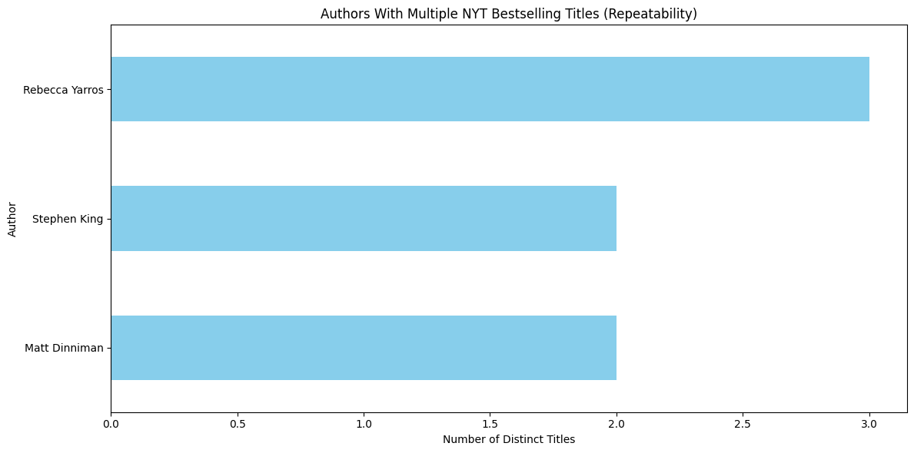

 

Table of Contents
 
<ol> 
<li> <a href="#about-the-project">About The Project</a> <ul> <li><a href="#built-with">Built With</a></li> 
</ul> </li> <li> <a href="#project-overview">Project Overview<a> 
<ul> <li><a href="#rank-dynamics">Rank Dynamics</a></li> <li><a href="#author--publisher-patterns">Author & Publisher Patterns</a></li> 
 </ul> </li> </ol> 

<!-- ABOUT THE PROJECT -->
## About The Project

This project analyzes The New York Times Hardcover Fiction Bestseller List across weekly publications (for the past few months). Using automated data ingestion, transformation, and visualization, the analysis explores rank behavior, title longevity, author dominance, and overall market dynamics.

The goal is to identify patterns such as:
1. Which books dominate the most weeks
2. Rank volatility and rank momentum
3. How new titles enter and exit the list
4. Author and publisher performance trends
5. Long-term vs short-term bestsellers

Dataset Source: NYT Books API (via weekly list pulls)
> Preprocessing script included (preprocessor.py)

(<a href="#readme-top">back to top</a>)

## Built With 

* [![Python][Python.py]][Python-url]
* [![Pandas][Pandas]][Pandas-url]
* [![Seaborn][Seaborn]][Seaborn-url]
* [![Matplotlib][Matplotlib]][Matplotlib-url]
* [![Requests][Requests]][Requests-url]

(<a href="#readme-top">back to top</a>)

## Project Overview

This project includes:
1. Automated weekly API ingestion from NYT Books API
2. A full data cleaning + merge pipeline for title-level aggregation
3. Feature engineering around:
> Weeks on list

> Rank changes

> Cumulative rank score

> Entrant type (new / returning)

> Stability & volatility metrics

4. Deep rank dynamics analysis across the 2025 period
5. Author-level & publisher-level insights
6. Market behavior modeling, such as seasonality, momentum, clustering
7. All visualizations prepared for a slide deck

(<a href="#readme-top">back to top</a>)

## Rank Dynamics

#### 1. Cumulative Rank Score (All-Time Bests)
> Which books consistently performed the best across the entire period?

**INSIGHT:**
The cumulative-rank data shows a clear performance stratification:

* Top-tier leaders (“A Curse Carved in Bone,” “The Intruder,” “Rose in Chains,” “For Richer for Poorer”) exhibit sustained, high-rank stability, indicating strong repeat demand and durable readership engagement.
* Mid-tier titles maintain moderate consistency but lack breakout momentum.
* Lower-tier titles still chart but show weaker long-term retention.

**ACTION:**
* Double-down on top performers: expand promotions, cross-media campaigns, merchandising, and extended print runs.
* Nurture mid-tier: targeted remarketing, author-centric features, and limited-time price drops to lift visibility.
* Stabilize lower-tier: reposition with niche marketing, refreshed blurbs/covers, or seasonal pushes to regain momentum.

#### 2. Rank Stability vs Volatility
> Which titles stayed consistently strong, and which fluctuated week-to-week?

**INSIGHT:**
* Extremely stable top performers:
A CURSE CARVED IN BONE, THE INTRUDER, ROSE IN CHAINS, and FOR RICHER FOR POORER hold steady in ranks 1–2 with almost zero movement.
* Moderate volatility:
THE SECRET OF SECRETS dips briefly before stabilizing.
* Severe volatility:
BURY OUR BONES IN THE MIDNIGHT SOIL shows a dramatic collapse from top rank to #15 — the steepest drop in the dataset.

**ACTION:**
* Keep momentum on stable titles — they maintain themselves; minimal intervention required beyond standard promotion.
* Support moderately volatile titles with periodic boosts (ads, features, socials) during dips to prevent further decline.
* Investigate the collapse on highly volatile titles — consider repositioning, stronger promo cycles, or timing adjustments to restore upward traction.

#### 3. Weekly Rank Movement (Up/Down/Flat)
> How do titles move each week? Do most books climb, fall, or stagnate?

**INSIGHT:**
Most titles exhibited extremely low week-to-week movement (primarily Flat tallies), showing that once a book entered the list, its position tended to stay stable. Only a few titles—such as The Stormlight Archive, Rose in Chains, and The Irresistible Urge…—show meaningful fluctuations, suggesting more dynamic momentum or competition around their rank.

**ACTION:**
Spotlight books with high Up counts in newsletters or ads (they show upward momentum). Monitor books with high Down counts for potential decline triggers (competition, seasonality, pricing, etc.). Titles with high Flat counts may benefit from fresh marketing pushes to break their stagnation.

#### 4. New Entrants vs Returning Titles
> Do newcomers dominate, or do returning titles hold the charts?

**INSIGHT:**
Returning titles dominate the list: ~85% of all weekly chart appearances come from books that were already on the list. Only ~15% of appearances are true new entrants, meaning the list is highly “sticky” and favors ongoing performers rather than fresh debuts.

**ACTION:**
Shift analysis toward sustained performance instead of one-week debuts. Track which titles have “long tail” strength, and prioritize deeper analysis of books that remain for 8+ weeks, since they drive the majority of chart behavior.

(<a href="#readme-top">back to top</a>)

## Author & Publisher Patterns

1. Top Authors by Rank Score
> Which authors sustained the longest presence?

**Authors - INSIGHT:**
* Rebecca Yarros overwhelmingly dominates, appearing 40 times — far ahead of every other author.
* A strong upper-mid tier cluster (Backman, Reid, King) consistently maintains visibility, indicating ongoing readership momentum.
* The remaining authors appear regularly but show more episodic presence, suggesting dependence on release cycles.

**Authors - ACTION:**
* Prioritize deep-dive author profiling for top 3–4 “evergreen” performers.
* Allocate more monitoring resources to Yarros, Backman, Reid, King since they reliably drive visibility.
* For mid-tier authors, track release-driven spikes and plan campaigns or alerts around predicted lift windows.

2. Top Publishers by Rank Score
> Which publishers sustained the longest presence?

**Publishers - INSIGHT:** 
* Red Tower Books is the breakout leader with 45 appearances, significantly outpacing second-place Atria (30).
* Little, Brown and Berkley also show strong sustained chart penetration.
* Mid-tier publishers (Ballantine, Scribner, Ace) appear consistently but with lower ceiling — still meaningful but less dominant.

**Publishers - ACTION:**
* Highlight Red Tower as the primary driver of bestseller density and investigate which titles drive the surge.
* Map publisher clusters to identify which houses reliably release multiple chart makers.
* For mid-tier publishers, monitor release timing to see whether certain seasons produce higher bestseller yield.

3. Author Repeatability (Multiple Titles)

**INSIGHTS:**
* Only three authors published multiple NYT-charting books from June–Dec 2025:
> Rebecca Yarros (3 titles), Stephen King (2 titles), Matt Dinniman (2 titles).
* Yarros is the dominant multi-title performer, outpacing others by a significant margin.
* Repeatability is rare, indicating that most charting authors only had one major title during this period.

**ACTION:**
* Prioritize repeat authors for forecasting future bestsellers  because their new releases are statistically more likely to chart.
* Watch upcoming releases from Yarros, King, and Dinniman; they show strong market momentum.
* Use repeatability as a scoring feature in your predictive models (e.g., binary “repeat author” flag).

(<a href="#readme-top">back to top</a>)

[Python.py]: https://img.shields.io/badge/python-3776AB?style=for-the-badge&logo=python&logoColor=white
[Python-url]: https://www.python.org/
[Pandas]: https://img.shields.io/badge/pandas-150458?style=for-the-badge&logo=pandas&logoColor=white
[Pandas-url]: https://pandas.pydata.org/
[Seaborn]: https://img.shields.io/badge/seaborn-4C72B0?style=for-the-badge&logo=seaborn&logoColor=white
[Seaborn-url]: https://seaborn.pydata.org/
[Matplotlib]: https://img.shields.io/badge/matplotlib-11557C?style=for-the-badge&logo=matplotlib&logoColor=white
[Matplotlib-url]: https://matplotlib.org/
[Requests]: https://img.shields.io/badge/requests-005F73?style=for-the-badge&logo=python&logoColor=white
[Requests-url]: https://docs.python-requests.org/
